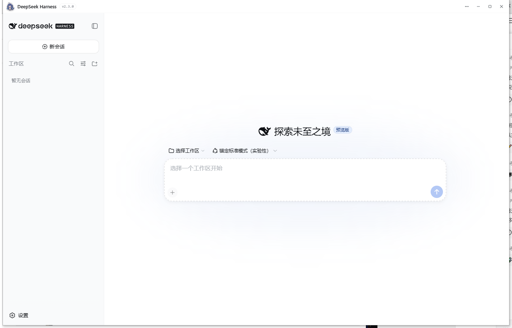
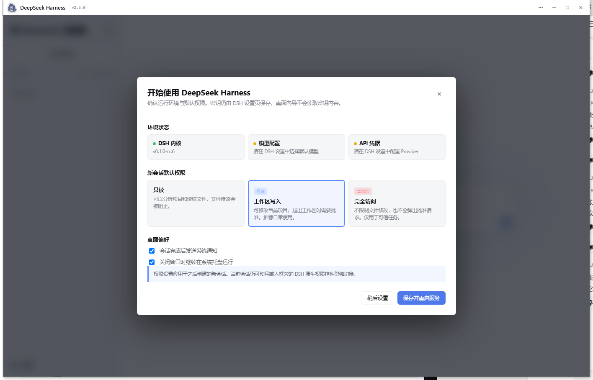

# DeepSeek Harness Desktop

官方 [@deepseek-ai/dsh](https://www.npmjs.com/package/@deepseek-ai/dsh)（DeepSeek Harness）的零配置 Windows 桌面发行版：内置运行时、桌面工作流与配套插件，双击即可进入本地 Coding Agent 工作台。



- ✅ **首次启动向导**：检测 DSH 内核、默认模型与凭据状态，集中设置新会话默认权限、通知和托盘偏好
- ✅ **三档权限模式**：支持只读、工作区写入与完全访问；向导设置新会话默认值，会话内仍可用 DSH 原生控件独立切换
- ✅ **独立会话分屏浮窗**：支持将任意会话弹出为独立无边框悬浮小窗（`persist:dsh-float` 隔离分区），支持最多 8 个多会话并排与分屏对照
- ✅ **全量配置备份与安全恢复**：支持一键将 profile 与全局配置导出为防逃逸 JSON 备份，恢复时具备符号链接安全防写穿、两阶段令牌校验与自动回滚（`desktop-backup.js`）
- ✅ **双自愈韧性防护**：启动前自动递归校验插件入口并自愈配置（`patch-row-heal`）；运行时多级防白屏崩溃自愈（`renderer-recovery` 指数退避 + 窗口重建 + 本地错误恢复页 + 看门狗）
- ✅ **实时费用与余额监控**：支持 DeepSeek 官方 API 余额查询，深度适配 2026 官方峰谷分时电价换算，并支持 OpenCode Go 订阅配额监控（`balance.js`）
- ✅ **会话监视器 v2**：采用 `fs.watch` 事件驱动增量 zstd 解析与损坏帧容错滑动窗口，稳态 CPU 占用暴降 75%，任务完成毫秒级通知
- ✅ **客户端双源自更新**：支持 GitHub / Gitee 双源在线检查与一键升级，便携版支持进程外原地热替换，自动感知企业代理
- ✅ **插件安全防护与快照回滚**：插件安装前自动创建配置快照，内置静态木马模式扫描拦截，支持一键秒级回滚（`plugin-guard.js`）
- ✅ **版本与诊断**：统一展示桌面端/内核/Overlay 版本、服务状态、运行路径与日志位置，支持一键复制脱敏诊断信息
- ✅ **免安装 Node**：内置独立的 Node 运行时与 npm CLI，目标机器无需安装 Node.js
- ✅ **内置 dsh CLI**：完整打包 `@deepseek-ai/dsh` 及其核心组件，离线可用
- ✅ **一键启动**：双击即启动 `dsh web`，自动挑选空闲端口，就绪后加载到原生窗口
- ✅ **风格化无边框窗口**：无原生标题栏/菜单栏，自绘 36px 玻璃栏（专属图标 + 拖拽 + ⋯ 菜单 + 窗口控制），Win11 原生圆角；保留快捷键 Ctrl+R / F12 / F11
- ✅ **系统托盘常驻**：点关闭默认最小化到托盘（可设置），托盘菜单提供快速显示/退出
- ✅ **退出即清理**：退出应用自动结束 dsh 进程树，不留孤儿进程
- ✅ **便携绿色版**：数据与日志随心管理，拷到移动硬盘或任意目录即可运行
- ✅ **与 CLI 共享配置**：默认沿用 dsh 自身的 `DSH_HOME`（通常是 `~\.dsh`），已有会话与 API Key 直接生效
- ✅ **跟随官方更新**：官方 `@deepseek-ai/dsh` 发新版时弹窗提醒，经确认后自动下载安装，重启生效，失败自动保留旧版
- ✅ **快捷方式自动维护**：首次运行自动维护开始菜单快捷方式，支持系统级通知，exe 移动后自动纠正
- ✅ **文件更改追踪 + 一键还原**：详情面板「文件」标签页，聚合本会话 agent 修改过的全部文件（新建/修改/删除、行级 diff、逐文件或全部还原）
- ✅ **项目文件树与站内预览**：「文件」标签页提供层级文件树与站内 HTML/端口实时预览
- ✅ **会话内终端**：「终端」标签页内置持久 PowerShell shell，支持流式输出、命令历史、清屏与断线重连
- ✅ **会话完成系统通知**：Agent 任务跑完时弹 Windows 系统通知，点击回到窗口
- ✅ **界面皮肤切换**：设置页「皮肤」标签页内置多款精美 Web UI 皮肤，互斥切换、重启生效
- ✅ **📊 交互式卡片渲染**：模型输出 `<dsh-card>` 或架构/图表代码时，内联以独立磨砂沙箱卡片自适应渲染，支持一键重绘、复制代码与弹出预览
- ✅ **🧰 标准化 SKILL.md 技能体系**：支持 `~/.dsh/skills` 开放技能规范，内置代码评审、TDD、架构图表等开箱即用技能
- ✅ **专注 DSH 工作流**：围绕 DeepSeek Harness 的安装、配置、执行、审查、恢复和诊断提供完整桌面体验

## 首次使用



1. 启动应用，等待本地 DSH Web UI 就绪。
2. 首次向导会检查内核、模型和凭据配置状态。
3. 选择新会话默认权限：日常使用建议选择「工作区写入」。
4. 若模型或凭据尚未配置，请进入 DSH 设置页完成 Provider、API Key 与默认模型设置。
5. 以后可从标题栏 `⋯` 菜单重新打开「首次设置与默认权限」或「版本与诊断」。

> 桌面向导只检测凭据文件是否存在，不读取或展示 API Key 内容。权限默认值写入 DSH 自身的 `settings.yaml`，与 CLI 共享。

## 快速运行与构建

### 运行环境要求
- Windows 10 / 11 (x64)
- Node.js (仅开发与构建时需要) + npm

### 开发与打包命令

```powershell
# 1. 安装依赖
npm install

# 2. 准备内置 Node 与 npm 运行时
npm run fetch-runtime

# 3. 本地开发调试运行
npm start

# 4. 快速构建免安装目录包（输出到 dist/win-unpacked/）
npm run pack

# 5. 构建完整 Windows 便携版 / 安装包
npm run dist
```

## 核心架构设计

```
┌──────────────────────────────────────────────────────────┐
│  Electron 壳层 (main.js)                                 │
│  · 单实例锁 / 窗口生命周期 / 托盘管理                     │
│  · 会话完成监听 (session-watcher.js) → 系统通知            │
│  · 官方内核更新 (updater.js) → 用户同意后安装 overlay     │
│  · 进程树生命周期托管与优雅退出                           │
└──────────────┬───────────────────────────────────────────┘
               │  dsh web --host 127.0.0.1 --port 0
               ▼
       内置 node.exe + @deepseek-ai/dsh
       路径解析：用户目录 overlay > 内置包
       输出 "dsh web: http://127.0.0.1:<port>"
               │  解析 URL，轮询 HTTP 200
               ▼
       原生窗口加载 Web UI（仅本机回环访问）
```

| 架构决策 | 设计原因 |
| --- | --- |
| `asar: false` | dsh 依赖 sharp / node-pty / koffi 等原生二进制模块，必须以真实文件落盘加载 |
| 内置独立 node.exe + npm | 预编译原生模块 ABI 与 Node 版本严格绑定。内置运行时保证完全一致且开箱即用 |
| `npmRebuild: false` | 绝不为 Electron 重编译原生模块，保证内置独立 node.exe 稳定调用 |
| `--port 0` 动态分配 | 由操作系统分配空闲端口，彻底杜绝端口冲突；仅回环绑定（127.0.0.1）保证安全 |
| 退出时进程树清理 | dsh 会派生 powershell 等子进程，退出时由桌面壳统一回收，不占系统资源 |
| Overlay 增量更新 | 官方内核更新安装在用户目录 `agent` overlay 层，原程序目录不受污染且支持秒级回滚 |

## 目录结构

```
dsh-desktop/
├── main.js               # Electron 主进程（窗口、托盘、自绘标题栏 IPC、快捷方式维护）
├── updater.js            # @deepseek-ai/dsh 官方内核更新引擎（npm view 检查 / overlay 安装）
├── client-updater.js     # 客户端自更新引擎（GitHub/Gitee 双源、便携版原地替换、代理感知）
├── session-watcher.js    # 会话完成监听 v2（fs.watch 事件驱动 + zstd 增量多帧解码 + 损坏容错）
├── balance.js            # 实时费用与账户余额查询（2026 峰谷分时电价 + OpenCode 订阅额度）
├── renderer-recovery.js  # 渲染进程崩溃自愈状态机（防白屏、指数退避、窗口重建、本地错误页）
├── watchdog.js           # 独立轻量看门狗进程（异常退出守护）
├── plugin-guard.js       # 插件安全保护中心（配置快照备份、木马正则体检、一键秒级回滚）
├── preload.js            # 预加载脚本（自绘玻璃标题栏、窗口控制、菜单 IPC 与桥接）
├── preset-sync.js        # 预设同步与初始化
├── profile-module-heal.js# 模块阴影修复与环境自愈
├── patch-row-heal.js     # profile patch 配置管理与插件入口完整性自愈
├── landing/              # 官方宣发落地页（暗黑玻璃风单页）
├── assets/               # 静态资源、加载与恢复页面、图标、配套插件
│   ├── icon.ico          # 多分辨率专属 Windows 图标
│   ├── loading.html      # 启动加载过渡页
│   ├── recovery.html     # 本地故障恢复诊断页
│   ├── plugins/          # 核心配套插件（文件追踪、终端、皮肤切换、移动端修复等）
│   └── skins/            # 内置 5 款主题皮肤包（XP / Miku / 98 / Trading / THS）
├── scripts/
│   ├── fetch-node.js     # 内置 node.exe 拉取与复制
│   ├── fetch-npm.js      # 内置 npm CLI 拉取与复制
│   └── after-pack.js     # 构建后处理（npm 依赖补全、图标注入、冗余清理）
├── test/                 # 自动化单元测试套件
└── electron-builder.yml  # 打包配置文件
```

## 许可证

本项目基于 MIT License 开源。内置第三方组件遵循各自开源协议。
